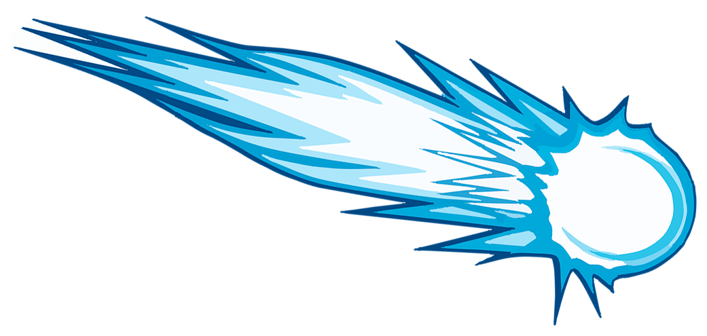

## Cometa
```
On-demand, on-the-fly, image resizing.
```
*Please note that this is work in progress, just ask if you need help with anything.*


## Requirements

Cometa uses [sharp](https://github.com/lovell/sharp) for super-fast image manipulation.<br />
In order to install `sharp` you will need to make sure all dependencies are satisfied. See its [installation instructions](http://sharp.dimens.io/en/stable/install/).


## Installation

- Copy the `.env.example` to `.env` and fill in the required values,
- clone this repository and navigate to its location,
- install what is needed: `npm install`,
- run the application, with grunt: `grunt nodemon`

Your application should now be running on the port you specified in your `.env` file.<br />
Currently it's only possible to fetch images from `AWS S3` buckets.


#### Environment variables

Defined in your `.env` variable or locally exported.

- `NODE_ENV`: How the application is run, currently has no effect.
- `PORT`: Port on which your application will listen.
- `COMETA_KEY`: A unique key used for request signature validation.
- `AWS_ACCESS_KEY`: Your AWS access key.
- `AWS_ACCESS_SECRET`: Your AWS access secret.
- `AWS_REGION`: Region of your S3 bucket.
- `AWS_BUCKET`: Name of your S3 bucket.


## Usage

If, inside your `AWS S3` bucket, you have a folder called `cometa` and inside it your image is called `superlight.jpg`, then you can request it like:

```
http://localhost:5050/noauth/cometa/superlight.jpg
```

This will only optimize the image and return it as `Content-Type: image/jpeg`. No image resizing.


#### Query parameters

- `w` or `width` *{integer}*: Output width,
- `h` or `height` *{integer}*: Output height, 
- `q` or `quality` *{integer}*: Output image quality (defaults to `80`, ignored with `png`)


#### Input formats

Currently only `jpg` is supported.


#### Output formats

Supported output formats are: `webp`, `png`, and `jpeg`.

Simply append the required format to the image URL:

```
http://localhost:5050/noauth/cometa/superlight.jpg.webp
http://localhost:5050/noauth/cometa/superlight.jpg.png
```


## Authentication

Look at this URL:

```
http://localhost:5050/noauth/cometa/superlight.jpg?width=200&height=200
```

A malicious user could easily overload your service by making thousands of different size requests.

Consider the following snipped of pseudocode:

```
for (int reqWidth = 1; reqWidth < 100000; reqWidth++) {
	for (int reqHeight = 1; reqHeight < 100000; reqHeight++) {
    	GET http://localhost:5050/noauth/cometa/superlight.jpg?width={reqWidth}&height={reqHeight}
	}
}
```

That's almost 10 billion requests. Most certainly your service is dead by now.

In order to prevent this, **Cometa** offers an authentication option -and we strongly recommend you use it. In order to authenticate a request you must compute a `SHA-1 hmac` signature and include it in your URL.


#### Signature generation

Again, let's look at this URL:

```
http://localhost:5050/noauth/cometa/superlight.jpg?width=200&height=200
```

From this URL, in order to generate a valid signature, you will need:

- The hostname `localhost:5050`
- the query string `/cometa/superlight.jpg?width=200&height=200`

Your *signature URL* will be: `localhost:5050/cometa/superlight.jpg?width=200&height=200`

- Generate a `SHA-1 hmac` of this URL with your `COMETA_KEY`,
- encode your signature to `hexadecimal`.

Append the signature to your URL, between the hostname and the query string (instead of `noauth` in the example URLs used above):

```
http://localhost:5050/{SIGNAURE-GOES-HERE}/cometa/superlight.jpg?width=200&height=200
```

**Note:** Using `noauth` in your URL stands for no request authentication whatsoever. (*Use at your own discretion*)


## License

The MIT License (MIT)

Copyright (c) 2016 [iBrag.it](http://ibrag.it)

Permission is hereby granted, free of charge, to any person obtaining a copy
of this software and associated documentation files (the "Software"), to deal
in the Software without restriction, including without limitation the rights
to use, copy, modify, merge, publish, distribute, sublicense, and/or sell
copies of the Software, and to permit persons to whom the Software is
furnished to do so, subject to the following conditions:

The above copyright notice and this permission notice shall be included in all
copies or substantial portions of the Software.

THE SOFTWARE IS PROVIDED "AS IS", WITHOUT WARRANTY OF ANY KIND, EXPRESS OR
IMPLIED, INCLUDING BUT NOT LIMITED TO THE WARRANTIES OF MERCHANTABILITY,
FITNESS FOR A PARTICULAR PURPOSE AND NONINFRINGEMENT. IN NO EVENT SHALL THE
AUTHORS OR COPYRIGHT HOLDERS BE LIABLE FOR ANY CLAIM, DAMAGES OR OTHER
LIABILITY, WHETHER IN AN ACTION OF CONTRACT, TORT OR OTHERWISE, ARISING FROM,
OUT OF OR IN CONNECTION WITH THE SOFTWARE OR THE USE OR OTHER DEALINGS IN THE
SOFTWARE.


